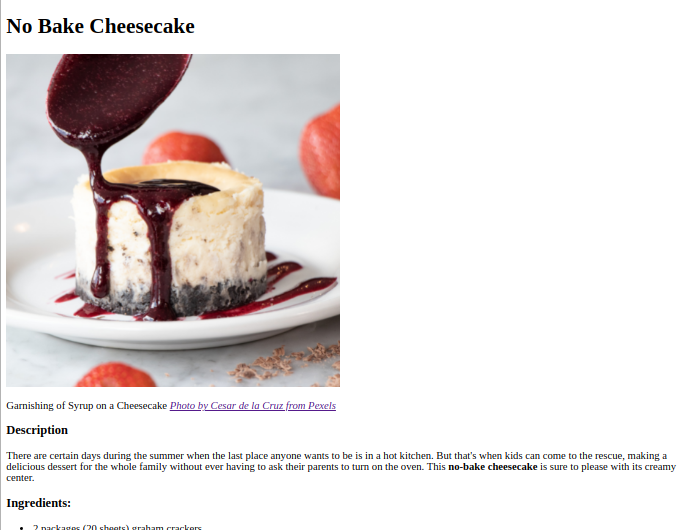

# Project Name

It's time to put what I've learned about HTML so far.
This practice project is a basic recipe website.

The website will consist of a main index page which will
have links to a few recipes. The website won't very pretty.

Please keep in mind this project is to demonstrate my HTML chops.
I will revisit this project in the future to style it up with CSS.

Additional description about the project and its features.

## Built With

- HTML5

## Live Demo

[Live Demo Link](https://livedemo.com)
